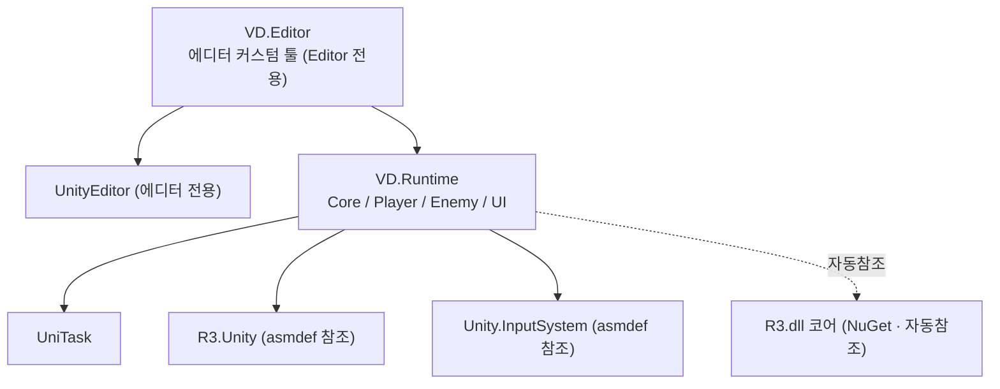

# 어셈블리 정의(asmdef) 설계 — VD.Runtime / VD.Editor

> 대상 작업: **M0-4 (프로젝트 골격)**. 이 문서는 Void Drift가 **어셈블리 정의 파일(asmdef)** 을
> 왜 도입했고, 특히 **이 프로젝트에서 왜 꼭 필요한지**를 중심으로 정리한다.
> 흐름: 개요 → 요구사항 → asmdef란 → **왜 써야 하는가(핵심)** → 필요 항목 → 구현 내용 → 구현 결과 → 운영 규칙.

관련 파일
- `Assets/Scripts/VD.Runtime.asmdef`
- `Assets/Scripts/Editor/VD.Editor.asmdef`
- ~~`Assets/Scripts/Core/VDRuntimeMarker.cs`~~ (M1-1에서 삭제 — 실코드가 참조 검증)
- `Assets/Scripts/Editor/VDEditorMarker.cs` (참조 검증용 임시 마커, M2까지 유지)

---

## 개요

Unity는 기본적으로 `Assets` 아래 모든 스크립트를 **자동 생성되는 두 덩어리**로 컴파일한다.

| 자동 어셈블리 | 대상 |
|---|---|
| `Assembly-CSharp.dll` | 일반 런타임 스크립트 전부 |
| `Assembly-CSharp-Editor.dll` | `Editor/` 폴더 안의 에디터 스크립트 전부 |

이 상태에서는 **폴더를 아무리 나눠도 컴파일·의존성은 한 덩어리**다. asmdef는 특정 폴더부터를
**별도의 컴파일 단위(DLL)로 분리**하고, "이 어셈블리는 어떤 어셈블리를 참조하는가"를 **명시적으로
선언**하게 해준다. Void Drift는 런타임과 에디터 코드를 각각 `VD.Runtime` / `VD.Editor` 두 어셈블리로
분리했다.

> **중요한 구분: 어셈블리(asmdef) ≠ 네임스페이스**
> - **네임스페이스**(`VD.Core`, `VD.Player`, `VD.Enemy`, `VD.UI`)는 *이름 정리* 단위.
> - **어셈블리**(`VD.Runtime`)는 *컴파일·의존성* 단위.
> - 그래서 여러 네임스페이스를 쓰면서도 **어셈블리는 하나로 묶을 수 있다.** 우리는 정확히 이렇게 한다.

---

## 요구사항

M0-4의 목표는 "런타임/에디터 코드 분리 기반을 마련"하는 것이다. 구체 요구사항:

1. **런타임 코드와 에디터 코드가 물리적으로 분리**되어야 한다. (핵심 어필이 에디터 툴이라 필수)
2. 에디터 코드는 런타임을 **참조 가능**하되, 런타임은 에디터를 **참조 불가**여야 한다. (단방향 의존)
3. 외부 라이브러리(UniTask · R3.Unity · R3 코어)를 **명시적으로 참조**해 의존성을 가시화한다.
4. 네임스페이스 루트는 `VD.*` (패키지 충돌 방지용 접두어).
5. 빈 골격만으로 **컴파일이 통과**하고, 이후 실제 코드가 이 구조에 안착할 수 있어야 한다.

---

## asmdef란 (배경)

- asmdef 파일 하나 = 어셈블리 하나. 그 파일이 놓인 폴더와 하위 폴더의 스크립트가 그 어셈블리로 묶인다.
  (단, 하위 폴더에 또 다른 asmdef가 있으면 거기서부터는 별개 어셈블리.)
- `references` 필드에 **참조할 다른 asmdef의 어셈블리 이름**을 적는다. 여기 없는 어셈블리의 타입은
  컴파일 시 보이지 않는다(→ 잘못된 의존을 막는 안전장치).
- `includePlatforms: ["Editor"]` 로 지정하면 그 어셈블리는 **에디터에서만 컴파일**되고 **빌드에서 제외**된다.
- 패키지 asmdef가 `autoReferenced: true` 여도, 그것은 *자동 생성 어셈블리*(`Assembly-CSharp`)에만
  자동 연결된다는 뜻이다. **커스텀 asmdef(우리 것)는 필요한 참조를 직접 적어야 한다.**

---

## 왜 써야 하는가 (구현 이유) — 이 문서의 핵심

### A. 일반적인 이유 (모든 프로젝트 공통)

- **컴파일 속도 / 이터레이션**: 어셈블리를 나누면 **바뀐 어셈블리만 재컴파일**된다. 한 덩어리면 스크립트
  한 줄만 고쳐도 전체가 다시 컴파일된다.
- **의존성 방향 강제**: `references`에 없는 어셈블리는 아예 안 보이므로, 원치 않는 의존이 코드에
  스며드는 것을 **컴파일 단계에서 차단**한다.
- **에디터/런타임 분리**: 에디터 전용 코드가 런타임 빌드에 섞이지 않도록 물리적으로 가른다.
- **의존성 가시화**: 어떤 외부 패키지에 의존하는지가 asmdef에 **선언으로 드러난다.**

### B. Void Drift에서 **꼭** 써야 하는 이유 (프로젝트 특수성)

> 아래가 이 프로젝트에서 asmdef를 *선택이 아니라 필수*로 만드는 지점들이다.

1. **핵심 어필이 UI Toolkit "에디터 커스텀 툴"이다 → 빌드 정합성 문제.**
   포트폴리오 1순위 기능(M2: 적 조합 오서링 창)은 `UnityEditor`·UI Toolkit `EditorWindow` API를 쓴다.
   **`UnityEditor` 네임스페이스를 참조하는 코드는 플레이어 빌드에 포함되면 컴파일이 깨진다.**
   에디터 툴 코드를 `includePlatforms: ["Editor"]` 인 `VD.Editor` 어셈블리에 격리해야
   **런타임 빌드에서 자동으로 빠진다.** 이 분리가 없으면 **M5 모바일 빌드(Must)가 성립하지 못한다.**
   → 즉 asmdef는 "핵심 어필 기능"과 "필수 산출물(모바일 빌드)"을 **동시에 성립**시키는 전제 조건이다.

2. **에디터 툴 ↔ 런타임 데이터의 단방향 의존.**
   에디터 툴은 런타임의 적 데이터 SO(M2-2)를 편집한다. 즉 **에디터 → 런타임** 참조는 필요하지만,
   그 반대(런타임이 에디터 툴에 의존)는 절대 안 된다. asmdef가 이 방향을 **강제**한다.
   (`VD.Editor` 만 `VD.Runtime` 을 참조. 역방향은 참조 목록에 없어 물리적으로 불가.)

3. **MCP 기반 반복 개발 → 컴파일 왕복이 잦다.**
   이 프로젝트는 Claude ↔ Unity(UnityMCP)로 스크립트를 자주 생성·수정하고 매번 컴파일을 돈다.
   런타임/에디터 분리로 **한쪽만 재컴파일**되면 왕복 비용이 줄어 개발 속도에 직접 기여한다.

4. **포트폴리오 신호.**
   어셈블리 분리는 **구조 이해도의 신호**다. "에디터 확장을 만들되 빌드/런타임과 깔끔히 분리했다"가
   코드 구조 자체로 드러나, 리뷰어에게 설계 의도를 말없이 전달한다.

5. **외부 리액티브 스택(R3/UniTask)의 명시적 관리.**
   런타임은 R3 코어·R3.Unity·UniTask에 의존한다. 이 의존을 `VD.Runtime.asmdef` 한 곳에 모아
   **어디서 무엇에 기대는지**를 명확히 한다. (에디터 툴은 필요할 때만 별도로 참조 추가.)

---

## 필요 항목 (구성)

우리가 도입한 어셈블리는 **2개**다. (폴더마다 쪼개지 않는다 — 과분리는 의존성 지옥을 부른다.)

| 어셈블리 | 위치 | 플랫폼 | 참조 | 담는 것 |
|---|---|---|---|---|
| `VD.Runtime` | `Assets/Scripts/` | 전체 | `UniTask`, `R3.Unity`, `Unity.InputSystem` (+ R3 코어 자동참조) | Core / Player / Enemy / UI 런타임 전부 |
| `VD.Editor` | `Assets/Scripts/Editor/` | **Editor 전용** | `VD.Runtime` | 에디터 커스텀 툴(UI Toolkit) 전부 |

폴더 골격 (`Assets/Scripts/`):

```
Scripts/
├── VD.Runtime.asmdef        ← 루트에 두어 하위 전체를 한 어셈블리로
├── Core/                    ← 유틸, 게임/결과 매니저, Interface 등 (namespace VD.Core)
│   └── (Interface/ 는 인터페이스가 생길 때 생성)
├── Player/                  ← 플레이어 + 플레이어용 총알 (namespace VD.Player)
├── Enemy/                   ← 적 + 적용 총알 (namespace VD.Enemy)
├── UI/                      ← 런타임 UI(uGUI): HUD·타이틀·결과 (namespace VD.UI)
└── Editor/
    └── VD.Editor.asmdef     ← 여기부터 별도 에디터 어셈블리
```

> 파일 규칙(사용자 결정): 인터페이스는 1파일 1개(`Core/Interface/`), 클래스는 1파일 1클래스
> (연관 소형 클래스는 가독성 우선 시 동거 허용). `public` struct는 별도 파일 + `Player/Struct` 등에 몰기.
> 총알은 별도 폴더 없이 `Player`/`Enemy` 안에 각자 구현(파일이 많아지면 그때 세분).

---

## 구현 내용

### 1. `VD.Runtime.asmdef`

```jsonc
{
    "name": "VD.Runtime",
    "rootNamespace": "VD",
    "references": [ "UniTask", "R3.Unity", "Unity.InputSystem" ],
    "includePlatforms": [],          // 전체 플랫폼(빌드 포함)
    "overrideReferences": false,     // 자동참조 precompiled DLL(R3.dll 등) 유입 허용
    "autoReferenced": true
}
```

- `references`에 **`UniTask`, `R3.Unity`, `Unity.InputSystem`** 을 명시. (커스텀 asmdef라 자동참조에 기대지 않고 직접 적음.)
- **`Unity.InputSystem` 주의**: 이 패키지 어셈블리도 `autoReferenced:true` 지만, 그건 자동 생성
  어셈블리(`Assembly-CSharp`)에만 자동 연결된다. **커스텀 asmdef인 `VD.Runtime`에는 이렇게 직접 적어야**
  런타임 코드에서 `UnityEngine.InputSystem` 타입이 보인다. (안 적으면 M1-2 입력 코드가 `CS0246`.)
- **R3 코어(`R3.dll`)** 는 NuGetForUnity가 넣은 precompiled DLL이라 asmdef `references`(=asmdef 전용)에
  넣을 수 없다. 대신 `overrideReferences: false` 로 두어 **자동참조 DLL이 그대로 유입**되게 했다.
  (검증 결과 `R3.Observable` 정상 해석 → 유입 확인.)

### 2. `VD.Editor.asmdef`

```jsonc
{
    "name": "VD.Editor",
    "rootNamespace": "VD.Editor",
    "references": [ "VD.Runtime" ],
    "includePlatforms": [ "Editor" ], // ★ 에디터 전용 → 빌드에서 제외
    "autoReferenced": true
}
```

- `includePlatforms: ["Editor"]` 가 **빌드 격리**의 핵심. 이 어셈블리는 플레이어 빌드에 포함되지 않는다.
- `references: ["VD.Runtime"]` 로 **에디터 → 런타임 단방향** 의존을 성립시킨다.

### 3. 참조 검증용 마커 (임시)

빈 어셈블리는 참조가 실제로 연결됐는지 증명하지 못하므로, **참조를 강제로 사용하는** 최소 마커를 두었다.
(실제 코드가 들어오면 삭제 예정.)

- `Core/VDRuntimeMarker.cs` — `using R3;` + `using Cysharp.Threading.Tasks;` 로 R3/UniTask 참조를,
  `typeof(Observable)` · `typeof(UniTask)` 로 실제 링크를 검증.
- `Editor/VDEditorMarker.cs` — `using UnityEditor;`(에디터 어셈블리 검증) +
  `VDRuntimeMarker.Assembly` 참조(에디터 → 런타임 검증).

> **갱신(M1-1)**: `VDRuntimeMarker`는 **삭제**됨 — R3 링크는 실코드 `GameEvents`(`using R3;`), Input System
> 링크는 `GameDebugDriver`(`using UnityEngine.InputSystem;`)가 검증한다(둘 다 `VD.Core`). UniTask 참조는
> asmdef에 선언은 유지되며 M1-3 실코드에서 exercise 예정. `VDEditorMarker`는 **유지**하되 참조를
> 삭제된 마커 대신 실제 런타임 타입으로 교체: `typeof(GameManager).Assembly.GetName().Name`(= `"VD.Runtime"`).
> 에디터 툴 실코드(M2)가 들어오면 이 마커도 삭제한다.

### 의존 관계



> 화살표는 "참조한다" 방향. **`VD.Runtime` → `VD.Editor` 방향 화살표가 없다는 점**이 곧
> "런타임은 에디터를 모른다"는 보장이다.

---

## 구현 결과 (검증)

`execute_code`(UnityMCP) 리플렉션으로 링크까지 확인:

| 검증 항목 | 결과 |
|---|---|
| `VD.Runtime` 어셈블리 로드 | ✅ `VD.Runtime` |
| `VD.Editor` 어셈블리 로드 | ✅ `VD.Editor` |
| 에디터 → 런타임 참조 | ✅ `VDEditorMarker.RuntimeRef == "VD.Runtime"` |
| R3 코어 참조 | ✅ `typeof(Observable)` = `R3.Observable` |
| UniTask 참조 | ✅ `typeof(UniTask)` = `Cysharp.Threading.Tasks.UniTask` |
| Input System 참조 | ✅ `typeof(Keyboard)` = `UnityEngine.InputSystem.Keyboard` |
| 컴파일 에러/경고 | ✅ 0 |

→ M0-4 DoD("빈 asmdef 2개로 컴파일 통과, Editor 어셈블리가 Runtime을 참조") **충족.**

---

## 운영 규칙 / 주의

- **에디터 전용 코드(`using UnityEditor;`)는 반드시 `Assets/Scripts/Editor/` 아래**(= `VD.Editor`)에 둔다.
  런타임 폴더에 두면 빌드가 깨진다.
- **어셈블리는 지금 2개로 유지.** 컴파일이 느려지거나 데이터 계층을 떼야 할 명확한 필요가 생기면
  그때 3번째(예: `VD.Data`)로 분리한다. 폴더마다 미리 쪼개지 않는다.
- **네임스페이스는 폴더별로**(`VD.Core`/`VD.Player`/`VD.Enemy`/`VD.UI`) 쓰되 어셈블리는 하나(`VD.Runtime`).
- 새 외부 패키지에 런타임이 의존하게 되면 `VD.Runtime.asmdef` 의 `references`에 **어셈블리 이름을 추가**한다.
  (에디터 툴만 쓰는 의존은 `VD.Editor` 쪽에 추가.)
- **빈 폴더 주의**: `Player`/`Enemy`/`UI` 는 아직 스크립트가 없어 폴더 `.meta` 만 존재한다. Git은 빈 폴더를
  추적하지 않으므로, 실제 코드가 들어오기 전까지는 클론 환경에서 폴더가 비어 보일 수 있다(정상).
- 마커 스크립트는 **참조 검증 목적의 임시 파일**이다. 실제 코드가 자리 잡으면 삭제한다. (M1-1: `VDRuntimeMarker` 삭제 완료. `VDEditorMarker`는 M2 에디터 툴 실코드 전까지 유지.)
```
