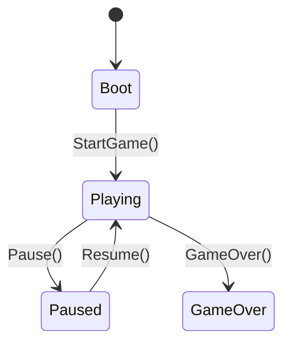

# 게임 상태 아키텍처 — GameManager / GameEvents / GameState (M1-1)

> 대상 작업: **M1-1 (게임 부트/상태 관리 골격)**. 이 문서는 GameScene의 진행 상태 흐름과
> 전역 접근점을 어떤 구조로 세웠는지, 그리고 **M1-2~M1-10이 상태·이벤트를 어떻게 참조하는지**를 정리한다.
> 작업 전 [context.md](../../context.md) → [backlog.md](backlog.md) 확인.

관련 파일 (`VD.Runtime`, ns `VD.Core`)
- `Assets/Scripts/Core/GameState.cs` — 상태 enum
- `Assets/Scripts/Core/GameEvents.cs` — 전역 pub/sub 채널(R3)
- `Assets/Scripts/Core/GameManager.cs` — 상태 관리자(MonoBehaviour 싱글톤)
- `Assets/Scripts/Core/GameDebugDriver.cs` — **[디버그·에디터 전용]** 키보드 상태전이(유지, `#if UNITY_EDITOR` 가드)

---

## 개요

M1-1은 "씬 진입~플레이~게임오버"의 **상태 흐름**과, 다른 시스템이 상태·이벤트를 얻는 **전역 접근점**을
세운다. 게임 로직(이동·사격·적…)은 없고, 이후 마일스톤이 올라탈 **뼈대**만 만든다.

- **상태 소유**: `GameManager`(MonoBehaviour 싱글톤)가 상태 전이와 `Time.timeScale`을 제어.
- **상태·이벤트 노출**: `GameEvents`(별도 pub/sub 채널)가 R3 스트림으로 상태를 방출. 다른 시스템은 **구독만**.
- **범위**: Title/Result는 **별도 씬**이므로 이 상태머신은 **GameScene 한정**.

---

## 설계 결정 (사용자 확정)

| 항목 | 결정 | 이유 |
|---|---|---|
| 전역 접근 패턴 | **MonoBehaviour 싱글톤** (`GameManager.Instance`) | Unity 관용·인스펙터 노출·수명 명확, 도메인 리로드 리셋 부담 없음 |
| 이벤트 버스 | **별도 `GameEvents` 채널** (GameManager가 소유) | 관심사 분리 — 상태관리(전이·timeScale)와 pub/sub를 분리 |
| 수명 | **씬 한정** (DontDestroyOnLoad 아님) | GameScene 로드마다 재생성. 씬 간 이월 불필요 |
| 상태 갱신 권한 | `GameEvents.SetState`는 **`internal`** | `GameManager`만 상태를 바꾸도록 컴파일 단계에서 제한 |
| 비동기 | M1-1은 **미사용** | 순수 상태머신 — UniTask/R3 온몸비틀기 회피(로딩 비동기는 M2 Addressables에서) |

---

## 상태 모델



- `GameState` = `Boot / Playing / Paused / GameOver`.
- **Boot**: 로딩 페이즈. 현재는 실제 로딩이 없어 `Start()`에서 즉시 `StartGame()`으로 Playing 진입.
  (실제 리소스 로딩/FadeOut 오버레이는 M2 Addressables 이후.)
- **Paused**: 3choice 팝업(M1-7) 등에서 `Time.timeScale=0`.
- **GameOver**: HP 0(M1-9). 현재 `timeScale=1` 유지(결과 처리·ResultScene 전환은 M1-9에서 연결).

전이 메서드는 **가드**를 둔다: `Pause()`는 Playing에서만, `Resume()`는 Paused에서만, `GameOver()`는
중복 무시. 잘못된 전이는 조용히 무시된다.

---

## 접근 계약 (M1-2~M1-10이 쓰는 법)

**상태 읽기 / 전이 (GameManager)**
```csharp
using VD.Core;

var gm = GameManager.Instance;   // GameScene에 배치된 싱글톤
gm.Pause();                      // 3choice 팝업 진입 시
gm.Resume();                     // 선택 적용 후
if (gm.State == GameState.Playing) { /* ... */ }  // 스냅샷 조회
```

**상태 구독 (GameEvents, R3)**
```csharp
using R3;
using VD.Core;

GameManager.Instance.Events.State
    .Subscribe(s => /* HUD 등 반응 */)
    .AddTo(this);                // MonoBehaviour 수명과 구독 해제 연동
```
- `Events.State`는 `ReadOnlyReactiveProperty<GameState>` — 구독 시 **현재값 즉시 방출**.
- 상태 변경 권한은 `GameManager`(내부 `internal SetState`)만. 외부는 읽기·구독만 가능.

> **게임플레이 이벤트**(처치/레벨업/오브 등)는 M1-1에선 넣지 않았다(과설계 회피). 각 백로그에서
> 필요해질 때 `GameEvents`에 R3 `Subject`/`Observable`로 추가한다 — `GameEvents`가 그 확장 지점이다.
> **M1-6에서 진행(경험치/레벨/레벨업) 이벤트가 실제로 추가됨 → [05_ProgressionAndEvents.md](05_ProgressionAndEvents.md).**

---

## 씬 배치 (GameScene)

- `GameManager` 오브젝트: `GameManager` + `GameDebugDriver`(임시) 컴포넌트.
- `Main Camera`(tag MainCamera, z=-10) / `Directional Light` — 씬 하이진용 기본값(위치·각도는 임시, 실제 구도는 이후 조정).

---

## 임시 요소 / 후속 정리

- **`GameDebugDriver`**(디버그·에디터 전용): New Input System(`Keyboard`)로 상태 전이를 수동 트리거. `P`=Pause/Resume 토글,
  `G`=GameOver, `R`=(GameOver 후) StartGame. 실제 입력·게임오버 트리거는 M1-2·M1-9에서 대체됐으나,
  **ResultScene(M2) 전까지 게임오버 후 재시작 등 테스트 편의로 유지 결정(2026-08-19).** `Update` 본문·`InputSystem` using을
  `#if UNITY_EDITOR`로 가드 → 빌드에선 무동작(inert). **삭제하지 말 것.**
- **M0-4 마커**: `VDRuntimeMarker`는 M1-1에서 **삭제**(R3 링크는 `GameEvents`, InputSystem 링크는
  `GameDebugDriver`가 실코드로 검증). `VDEditorMarker`는 **유지**(에디터 툴 실코드가 M2까지 없어
  VD.Editor 빌드격리+에디터→런타임 참조를 검증할 유일 수단, 참조 대상만 `GameManager`로 교체). → M2에서 삭제.

---

## 검증 (DoD)

| 항목 | 결과 |
|---|---|
| 플레이 진입 시 상태 로그 | ✅ `[GameManager] 상태 전이: Boot → Playing` |
| `Pause()` → timeScale | ✅ `Paused`, `Time.timeScale=0` |
| `Resume()` → timeScale | ✅ `Playing`, `Time.timeScale=1` |
| 가드(잘못된 전이 무시) | ✅ Paused 아닌데 Resume/ GameOver 중 Pause 무시 |
| 컴파일 에러 | ✅ 0 |

→ M1-1 DoD("상태 전환 로그로 확인, `Time.timeScale=0` 일시정지/재개 동작") **충족.**
