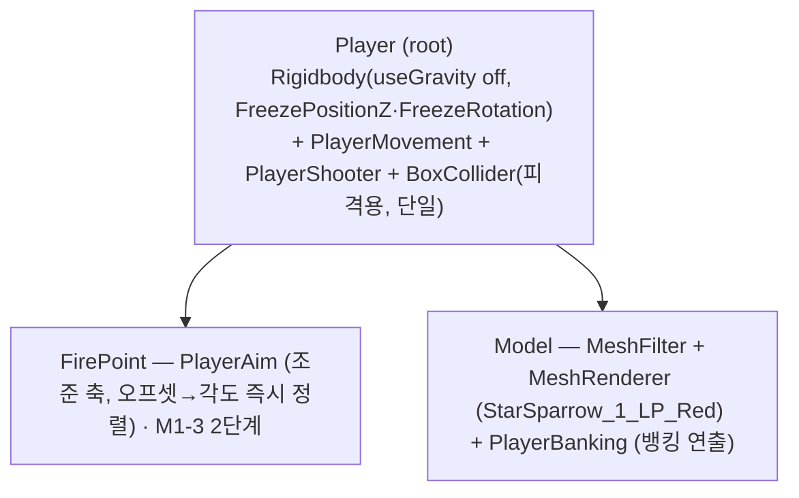

# 플레이어 이동 & 카메라 리그 — PlayerMovement (M1-2)

> 대상 작업: **M1-2 (플레이어 이동 — 상대 드래그, XY 자유·Z 고정)**.
> 이동 입력·물리·뱅킹 연출·카메라 프레이밍을 어떤 구조로 세웠는지, M1-3(오토사격)이 조준을 어디서 얻는지를 정리한다.
> 작업 전 [context.md](../../context.md) → [backlog.md](backlog.md) 확인.

관련 파일
- `Assets/Scripts/Player/PlayerMovement.cs` (ns `VD.Player`, 이동 전담)
- `Assets/Prefabs/Player.prefab` (StarSparrow_1_LP_Red 복제)
- `Assets/Scenes/GameScene.unity` (Main Camera 리그)

---

## 개요

플레이어 기체의 **이동만** 담당한다(사격·HP 등은 별도). 모바일 상대 드래그로 XY 이동하고 Z는 고정,
움직임에 따라 기체가 화면 중심을 향해 기울어지는 **뱅킹 연출**을 곁들인다.

- 클래스 `PlayerMovement` 하나가 **입력 → 물리 이동 → 뱅킹 회전 → 경계 클램프**를 처리.
- 카메라는 **고정**, 기체가 프레임 안에서 이동(클램프와 정합).

---

## 설계 결정 (사용자 확정)

| 항목 | 결정 | 메모 |
|---|---|---|
| 이동 입력 | **상대 드래그** (`Pointer.current` 델타 직접 읽기) | 액션 에셋 미사용. controls-design §3 |
| 입력 감도 | **해상도 무관 게인 `dragGain`** | 손가락 화면분율 × 게인 = 기체 화면분율 이동. 픽셀 아님 → 폰/에디터 동일 |
| 이동 방식 | **물리(Rigidbody) 속도 직접 매핑** | XY 자유, Z 고정 |
| 회전(뱅킹) | **직접 보간, 물리 아님** — 자식 비주얼(`Model`)의 로컬 회전만 | 물리 루트 회전은 완전 동결 |
| 뱅킹 가로 | **코가 안쪽(중심=조준)** = `invertYaw` OFF | 적 요격(원뿔 조준) 의도. 그림의 좌우 측면 매핑과는 반대(의도적) |
| 카메라 | **Perspective, 고정** (0,0,-26), FOV 55, near 0.3, far 300 | +Z 수평 정렬(뷰포트-평면 매핑 정확성 위해 틸트 없음) |
| 경계 | **카메라 뷰포트 자동** + 여백 | 해상도/기기 무관 |

> ⚠️ **갱신(밸런싱 패스, 2026-08-22) — 이동 입력 모델 변경**: 위 "상대 드래그 + `dragGain`"은 **폐기**.
> 포인터/터치 이동을 **방향형 플로팅 조이스틱**으로 전환했다 — 누른 지점에 베이스가 뜨고, 노브 오프셋(방향+세기)이
> 곧 속도. **스틱을 유지하면 그 방향으로 계속 이동**, 떼면 정지. 가상 스틱의 단일 소스 = `VD.UI.JoystickView`(입력+시각),
> `PlayerMovement`가 `JoystickView.Value`(단위 원반)를 읽어 키보드와 동일 파이프라인으로 뷰포트 목표에 가산.
> **플랫폼 게이트**: 에디터/모바일에서만 포인터 이동 활성 → **PC 스탠드얼론 빌드는 마우스 이동 차단(키보드만)**.
> `dragGain`/`deadZoneScreenFraction` 필드 삭제 → `pointerMoveSpeed`(조이스틱 최대 세기 시 초당 뷰포트 이동)·`deadZone01`(조이스틱)로 대체.
> 아래 M1-2 서술(상대 드래그·`dragGain`)은 **이력 기록**으로 보존. 조작 설계 = [controls-design.md](../Designs/controls-design.md) §3.

---

## 프리팹 구조 (물리 ↔ 비주얼 분리)

> 위는 **M1-3 완료 시점** 구조. (M1-2 때는 `Model`만 있었고 뱅킹은 `PlayerMovement`가 `bankTarget`로 참조했으나,
> M1-3에서 뱅킹=`PlayerBanking`(Model 자체 부착)·조준=`PlayerAim`(FirePoint)·발사=`PlayerShooter`(root)로 분리됨.)

- **물리 루트(Player)**: 위치만 물리로 이동, 회전은 완전 동결(절대 회전하지 않음). `BoxCollider`는 피격 판정용(32-박스 그룹을 단일 박스로 단순화, 트리거·수치는 M1-4/M1-9).
- **자식 `Model`**: 뱅킹 회전을 여기 로컬 회전으로만 적용(`PlayerBanking`) → **물리-회전 충돌 없음**.
- **자식 `FirePoint`**: 발사 원점·방향. `PlayerAim`이 조준 축을 즉시 정렬, `PlayerShooter`가 여기서 발사.
- 기체 방향: 모델 nose = +Z. 카메라가 뒤(-Z)에서 +Z를 보므로 기본은 **후면**이 보인다.

> **왜 자식 분리인가**: 뱅킹을 Dynamic Rigidbody의 `transform.rotation`에 직접 쓰면 빠른 이동 시 물리와
> 충돌해 미세 회전이 생겼다. 회전을 비물리 자식에 두어 제거. (사용자 결정 "회전=직접 보간, 물리 아님"과 정합)

---

## 동작 요약

- **입력(Update)**: 누르는 동안 `Pointer.current.delta` 누적.
- **이동(FixedUpdate)**: 누적 px → 화면 분율 → `× dragGain` → 목표 뷰포트. **목표를 경계 안으로 선-클램프** 후
  월드 변위/`fixedDeltaTime` = 속도. (`maxSpeed`=0이면 무제한.)
  - 선-클램프가 핵심: 경계에서 바깥으로 미는 속도가 애초에 안 생겨 **경계 떨림(overshoot↔clamp 진동) 방지**.
- **뱅킹(LateUpdate)**: 화면 중심 대비 정규화 오프셋 → `maxPitch/maxYaw/maxRoll` 비례 각도, `bankLerpSpeed`로
  `Model.localRotation` 보간. 위→아래면(nose-down), 우→코 안쪽(조준).
- **상태 게이트**: `GameManager.Instance.State != Playing`이면 이동·입력 정지(일시정지 정합).

## 인스펙터 파라미터 (수치는 Day5 튜닝)

`dragGain`(현재 5) · `deadZoneScreenFraction` · `maxSpeed`(0=무제한) · `spawnViewportPoint`(0.5, 0.42) ·
`viewportMargin` · `maxPitch` · `maxYaw` · `maxRoll` · `bankLerpSpeed` · `invertPitch` · `invertYaw`(OFF) · `bankTarget`.

---

## M1-3 (조준·발사) — 갱신(2026-08-18, **M1-3 완료**)

> **M1-3 `[x]` 완료** — 발사 파이프라인(발사기·투사체·상속형 풀)까지. 데미지/히트만 M1-4 이관. 발사 로직 상세는
> [backlog.md](backlog.md) M1-3 3단계. 아래는 조준(2단계) 구조 인계.

- **1단계 완료**: 뱅킹을 `PlayerMovement`에서 분리해 **`PlayerBanking`**(Model에 부착)이 담당.
  `PlayerMovement`는 **이동만**. 위 "프리팹 구조"의 `bankTarget` 서술은 M1-2 시점 기록이며, 현재 Model에는
  `PlayerBanking`이 붙어 스스로 뱅킹한다.
- **2단계 완료**: root 직속 자식 **`FirePoint`**(localPos 0, forward +Z) 생성 + 신규 **`PlayerAim`**(FirePoint 부착).
  흔들리는 `Model.forward`가 **아니라**, 오프셋에서 **즉시(보간 없음) 계산한 "깨끗한 조준 방향"**을 `FirePoint.localRotation`에
  적용한다. 공식은 `PlayerBanking`과 **동일**하되 **roll 생략**(forward 불변), **독립 필드**(maxPitch/maxYaw 기본 28/28 —
  조준 원뿔을 뱅킹 연출과 별도 튜닝). 임시 검증용 조준 축 기즈모(`drawAimGizmo`) 포함. root가 회전 동결이라 FirePoint는
  Model 뱅킹과 같은 부모 프레임 → 조준각과 뱅킹 목표각이 정합(단 FirePoint는 흔들림 없는 순수 방향).
- **조준 원뿔 중심축 = 뱅킹 방향**(= `FirePoint.forward`). 오프셋 0이면 +Z, 드래그하면 그쪽으로 축이 기욺.
- **원뿔 내 적 타겟 스냅(기관총·레일건)은 M1-4로 이관** — 적 엔티티가 있어야 실동작·검증. 무타겟이면 축(`FirePoint.forward`)
  직사, 원뿔에 적 있으면 그 적으로 조준. 유도탄은 축·원뿔과 무관한 별도 호밍(M4-1).
- **3단계 완료**: 발사 로직 = `PlayerShooter`(root, `Playing`에서 `fireInterval`마다 `FirePoint` 방향 발사) + `Projectile`(직진+수명, self-return) + 상속형 풀(`VD.Core.PooledObjectPool<T>` ← `ProjectilePool`). 탄속·수명·발사속도 튜닝은 `PlayerShooter` 한 곳(발사 시 `Projectile.Launch` 주입). 투사체 진행 = `FirePoint.forward`. **데미지/충돌은 M1-4**.
  → 발사·풀 상세는 [backlog.md](backlog.md) M1-3 3단계.

## 입력 정리 메모

- Unity6 기본 템플릿 `InputSystem_Actions.inputactions`는 M1-2에서 **삭제**했다(에셋 + `EditorBuildSettings`의
  `com.unity.input.settings.actions` 전역 참조 해제). 우리는 액션 에셋 없이 `Pointer.current`/`Keyboard.current`를
  직접 읽는다. 이후 액션 에셋이 필요해지면(예: UI 입력) 그때 도입.

---

## 알려진 이슈

- **I-1 · 이동 관성감**(보류): 빠른 이동/정지 시 미끄러지는 느낌. 떨림·물리회전 충돌과는 별개 원인(미확정).
  → [issues.md](issues.md) I-1.

## 검증 (DoD)

| 항목 | 결과 |
|---|---|
| 상대 드래그 XY 이동, Z 불변 | ✅ (에디터 마우스 드래그, 사용자 확인) |
| 해상도 무관 감도 | ✅ `dragGain`(화면 분율 기준) |
| 뱅킹 상단→아래면 | ✅ Model pitch +25°, 루트 회전 0 유지 |
| 경계 떨림 | ✅ 목표 선-클램프로 제거(3000px 바깥 드래그에도 경계 정지·속도 0) |
| 컴파일/런타임 에러 | ✅ 0 |

→ M1-2 DoD 충족(관성감 I-1은 보류).
