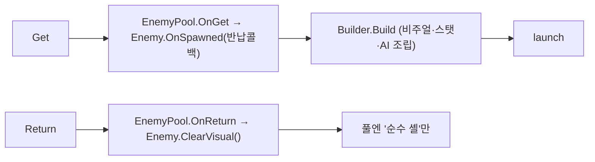
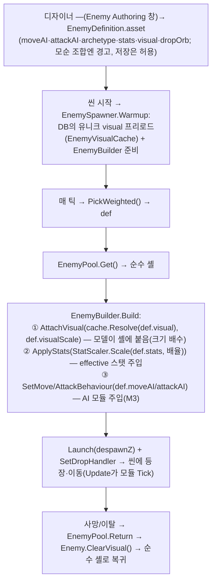

# 적 조합 파이프라인 — 데이터 · 오서링 · 유효성 · 런타임 조립 · AI 모듈 (M2~M3)

> **하나의 데이터 스키마**를 축으로, **에디터 오서링 툴**이 그것을 편집·검증하고 **런타임 빌더**가 그것을 조립(비주얼+스탯+AI)해 적을 만든다.
> 이 "조합형 적"(고정 적이 아님) 파이프라인이 M2의 산출물이자 **포폴 공고 1순위 어필**(UI Toolkit 에디터 커스텀 툴). **AI 모듈(이동/공격) = M3-1/M3-2에서 ③ 자리를 채움**(§4.7).
> 기획 근거 = [enemy-design.md](../Designs/enemy-design.md) §2·§4·§5·§6·§7 · 난이도 배율 = [progression-design.md](../Designs/progression-design.md) §2. 작업 전 [context.md](../../context.md) 확인.

관련 파일

데이터 (`VD.Runtime` / ns `VD.Core`)
- `Assets/Scripts/Data/EnemyDefinition.cs` — 적 조합 정의 SO(축)
- `Assets/Scripts/Data/EnemyStats.cs` — 능력치 `struct`
- `Assets/Scripts/Data/OrbDefinition.cs` — 오브 종류 SO
- `Assets/Scripts/Data/EnemyValidation.cs` — 유효성 R1·R2 + `EnemyWarning`
- `Assets/Scripts/Data/StatScaler.cs` — base×배율→effective
- `Assets/Scripts/Core/DifficultyProvider.cs` — 전역 배율 소스(스텁)
- `Assets/Scripts/Core/Enum/{MoveAIType,AttackAIType,Archetype}.cs`

오서링 툴 (`VD.Editor` / `Assets/Scripts/Editor/Authoring/`)
- `SoTableEditorView.cs` — 재사용 제네릭 베이스 뷰 · `EnemyTableEditorView.cs` — 적 도메인 뷰(+R3) · `EnemyAuthoringWindow.cs` — 창 · `SoTableEditor.uss`

런타임 조립 (`VD.Runtime` / ns `VD.Enemy`, `VD.Core`)
- `Assets/Scripts/Enemy/Enemy.cs` — 로직 셸 · `EnemyBuilder.cs` — 조립 seam · `EnemyVisualCache.cs` — 비주얼 로드/재사용 · `EnemyPool.cs` · `EnemySpawner.cs` — DB·스폰 · `Assets/Scripts/Core/PooledObjectPool.cs` — 풀 베이스

AI 모듈 (M3-1/M3-2/M3-3, `VD.Runtime` / ns `VD.Enemy`, `Assets/Scripts/Enemy/AI/`)
- 이동: `IMoveBehaviour.cs` · `StraightMove.cs` · `ChaseMove.cs` · `WeaveMove.cs`(M3-3, M4-7 선반영)
- 공격: `IAttackBehaviour.cs` · `ContactAttack.cs` · `BarrageAttack.cs` · `AimedShot.cs`(M3-3, M4-7 선반영) · `SuicideAttack.cs`
- 공용: `PlayerLocator.cs`(Player 태그 조회) · 적탄 `Assets/Scripts/Enemy/EnemyBullet.cs` · `EnemyBulletPool.cs` · 타격 대상 `Assets/Scripts/Player/PlayerHealth.cs`(`ApplyDamage`)

---

## 개요 — 아키텍처 한눈에

```mermaid
graph TD
    subgraph Authoring["오서링 (VD.Editor)"]
        Win["EnemyAuthoringWindow<br/>└ EnemyTableEditorView : SoTableEditorView&lt;T&gt; (편집 + 유효성 경고)"]
    end
    subgraph DataAxis["데이터 축 (VD.Core)"]
        Def["EnemyDefinition SO<br/>비주얼×이동AI×공격AI×아키타입×스탯×드랍오브"]
        Val["EnemyValidation (유효성 판정 입력)"]
    end
    subgraph RuntimeAxis["런타임 (VD.Enemy)"]
        Spawner["EnemySpawner (DB=SpawnEntry 배열, 가중랜덤)"]
        Builder["EnemyBuilder<br/>①비주얼(EnemyVisualCache) ②스탯(StatScaler×DifficultyProvider)<br/>③AI(def.moveAI/attackAI → IMove/IAttackBehaviour 모듈, M3)"]
        Shell["Enemy (로직 셸, Update가 모듈 Tick 위임)"]
    end
    Win -->|편집/저장| Def
    Val -.판정 입력.-> Def
    Def -->|소비(읽기 전용)| Spawner
    Spawner -->|pick| Builder
    Builder -->|assemble| Shell
    Shell -->|launch| Scene["씬"]
```

**핵심 원칙**: 비주얼·AI·스탯은 아키타입/모델에 고정되지 않고 **조합마다 주입**된다([enemy-design.md](../Designs/enemy-design.md) §2). 프리팹을 종류마다 만들지 않고 — **공통 로직 셸 하나 + 조립(빌더)** 로 다양성을 낸다. AI도 **재사용 순수 C# 전략 모듈**을 SO enum으로 골라 주입(§4.7).

---

## 1. 데이터 스키마 (축)

### 1.1 `EnemyDefinition` (SO)

한 인스턴스 = 한 적 조합. `[CreateAssetMenu(menuName = "Void Drift/Enemy Definition")]`, `sealed`.

| 필드 | 타입 | 의미 |
|---|---|---|
| `visual` | `AssetReferenceGameObject` | 모델 프리팹(Addressables `Enemy` 그룹). 런타임에 로드·주입 |
| `visualScale` | `float` | 비주얼 크기 배수(M3-3, 모델별 편차 보정). 기본 1, 0이하는 1. 비주얼 자식에만 곱(히트박스 셸 불변) |
| `moveAI` | `MoveAIType` | 이동 AI 종류(실 로직 M3-1) |
| `attackAI` | `AttackAIType` | 공격 AI 종류(실 로직 M3-2) |
| `archetype` | `Archetype` | 아키타입 — **교전거리(range) 파생원** |
| `stats` | `EnemyStats` | 능력치(base) |
| `dropOrb` | `OrbDefinition` | 실사망 드랍 오브(1개 고정) |

**range는 저장 필드가 아니라 `archetype`에서 파생**(단일 소스). `RangeLabel`(인스턴스) / `static RangeLabelOf(Archetype)`가 문자열(`원거리`/`근거리`/`복합`)을 돌려주며, Addressables `range:` 라벨과 **동일 문자열**로 유효성·라벨 교차의 기준이 된다.

```
public static string RangeLabelOf(Archetype a) => a switch {
    Archetype.Shooter => "원거리", Archetype.Charger => "근거리",
    Archetype.Bomber  => "근거리", Archetype.Hybrid  => "복합", _ => "복합" };
```

### 1.2 enum

| enum | 값 | 성향(유효성·조립 근거) |
|---|---|---|
| `MoveAIType` | `Straight` · `Chase` · `Weave` · `Hover` | `Hover`=거리유지, 나머지=접근 |
| `AttackAIType` | `Contact` · `AimedShot` · `Barrage` · `Suicide` | `Contact`/`Suicide`=근접필수, `Barrage`=원거리, `AimedShot`=무관 |
| `Archetype` | `Shooter` · `Charger` · `Bomber` · `Hybrid` | range 파생원. `Shooter`(사격형)는 `AttackAIType.Barrage`(탄막)와 이름 충돌 회피용 용어 |

### 1.3 `EnemyStats` (struct) 와 **스탯 3층 모델** ★

`[Serializable] struct` — 공통 4(`maxHp`·`moveSpeed`·`damage`(float)·`killScore`(int)) + 공격AI별 4(`fireInterval`·`projectileSpeed`(float)·`barrageCount`(int)·`suicideRadius`(float)).

`EnemyDefinition.stats`는 **base(읽기 전용 기준값)** 이다. 시간/난이도에 따라 적이 강해지는 배수는 여기 쓰지 않는다 — **세 층으로 분리**한다:

| 층 | 무엇 | 소유 | 예 |
|---|---|---|---|
| **base** | 적별 기준 스탯 | `EnemyDefinition.stats` (테이블, RO) | Charger maxHp 80 |
| **전역 배율** | 시간/페이즈에 따른 체력·속도·데미지 배수 | `DifficultyProvider` (진행/난이도) | ×1.0(스텁) → M4-5 곡선 |
| **effective** | base × 배율 = 이 스폰의 실제값 | 런타임, `Enemy` 인스턴스(주입) | 80 × 배율 |

이 분리 덕에 테이블은 불변으로 유지되고, 난이도 상승은 배율 층만 바꾼다. (배율 대상 = **체력/속도/데미지**뿐 — `killScore`·공격AI별 필드는 배율 밖. [progression-design.md](../Designs/progression-design.md) §2.)

### 1.4 `OrbDefinition` (SO) — 오브 결정 (a)

`xpValue`(int) + `visual`(GameObject) 둘뿐. **오브 동작(자석/습득)은 공유 `Orb` 하나**가 담당하고, 종류를 가르는 건 xp+비주얼뿐 → 드랍 시 공유 Orb에 비주얼 주입(DRY). ⚠️ 이 드랍 데이터화(오브가 `dropOrb.xpValue`로 발행 / `dropOrb.visual` 주입)의 **런타임 배선은 이후 단계** — 현재 드랍은 공유 Orb 고정.

---

## 2. 오서링 툴 (VD.Editor)

### 2.1 재사용 베이스 `SoTableEditorView<T>`

`class SoTableEditorView<T> : VisualElement where T : ScriptableObject` — 특정 SO 타입의 에셋 전체를 한 패널에서 **목록 + 상세 편집 + CRUD**로 다루는 제네릭 뷰.

- **`EditorWindow`가 아니라 `VisualElement`** — 별창이든 허브 탭이든 동일 패널을 꽂아 재사용(확장성의 실체·관심사 분리). 도메인 에디터는 이 뷰를 상속해 컬럼/폴더/훅만 지정.
- 구성: 툴바(`New`/`Delete`/`Reload` · `Export CSV`/`Import CSV`) · 좌 목록(`MultiColumnListView`) | 우 상세(`ScrollView`), `TwoPaneSplitView` 분할.
- 상세 = 선택 에셋의 `SerializedObject`를 `PropertyField`로 나열(자동 바인딩) + 에셋명 편집(`RenameAsset`).
- 저장 = 명시 버튼 없이 `SaveCurrent()`(`SetDirty`+`SaveAssetIfDirty`)가 **선택 전환/창 닫힘 시** 자동. **유효성과 무관**(경고 있어도 저장).
- 확장 지점(override/훅): `AssetFolder` · `NewAssetBaseName` · `ConfigureColumns` · `CustomizeDetail` · `Items` · `RefreshRows`.
- **CSV export/import(밸런싱 편의, 전 툴 공통)**: `SerializedProperty`로 **숫자·bool·enum 리프**(+ 중첩 struct 스칼라, 예 `stats.maxHp`)만 평탄화. 첫 열=에셋명(행 키), enum=이름, 소수점=`.`(InvariantCulture). **제외**=배열(`Entry[]` 등)·오브젝트참조(`dropOrb`)·Addressables 참조(`visual`)·문자열. **Import=에셋명 매칭 업데이트만**(없는 이름=경고·건너뜀, 신규 생성/삭제 없음). 스프레드시트에서 수치 일괄 편집 → 재임포트 워크플로우.

> 편집 UI = `PropertyField` 직행(중간 추상 생략). 스키마가 완성돼 애매함이 없고, 소비층(런타임)이 데이터를 읽기만 하므로 버릴 코드를 만들 이유가 없다.

### 2.2 적 도메인 뷰 `EnemyTableEditorView`

`sealed : SoTableEditorView<EnemyDefinition>`.

- **컬럼**: `⚠`(경고 행) · `Name` · `Archetype` · `MoveAI` · `AttackAI` · `Range`(파생 `RangeLabel`).
- **공격AI별 스탯 필드 비활성**(`CustomizeDetail`→`ApplyAttackFieldStates`/`RelevantAttackStats`): 선택 `AttackAIType`이 안 쓰는 stats 필드를 그레이아웃(`Contact`=없음 / `AimedShot`=발사간격·탄속 / `Barrage`=+탄막수 / `Suicide`=자폭반경). 중첩 필드 비동기 빌드라 준비될 때까지 `schedule.Execute` 재시도.
- **유효성 경고**(§3)도 이 뷰가 렌더.

### 2.3 창 `EnemyAuthoringWindow`

`sealed : EditorWindow`. `[MenuItem("Window/Void Drift/Enemy Authoring")]`로 열리고, `CreateGUI`에서 `SoTableEditor.uss` 로드 후 `EnemyTableEditorView` 하나를 호스팅. (별창 vs 허브 탭은 2번째 도메인 에디터를 만들 때 결정 — 베이스가 둘 다 저렴하게 함.)

---

## 3. 유효성 (테이블 → 검증 툴)

모순 조합에 **경고만** 띄우고 **저장은 막지 않는다**([enemy-design.md](../Designs/enemy-design.md) §4). 이 격상이 포폴 서사의 핵심.

### 3.1 규칙

메타 파생: `EnemyValidation.TendencyOf(MoveAIType)`(→`Approach`/`KeepDistance`) · `RangeOf(AttackAIType)`(→`Melee`/`Any`/`Ranged`) · `EnemyDefinition.RangeLabelOf`.

| 규칙 | 조건 | 경고 |
|---|---|---|
| **R1** (공격AI↔이동AI) | 근접필수(`Contact`/`Suicide`) + 거리유지(`Hover`) | 붙지 않아 발동 못함 |
| **R2** (아키타입 range↔공격AI) | 근거리형(`Charger`/`Bomber`)+`Barrage` / 원거리형(`Shooter`)+근접 | 교전거리 모순 |
| **R3** (§6 비주얼 라벨 교차) | 배정 비주얼의 Addressables `archetype:` 라벨 집합 밖 archetype | 부자연스러운 조합 |

### 3.2 왜 R1·R2는 Core, R3는 Editor인가 ★

- **`VD.Core.EnemyValidation.Validate(EnemyDefinition)`** → `List<EnemyWarning>`(R1·R2). enum만 보는 **순수 로직**이라 런타임도 접근 가능한 Core에 둔다. `EnemyWarning` = `Message`(string) + `Fields`(string[], 하이라이트용 필드명).
- **R3**는 비주얼의 Addressables 라벨을 조회해야 하는데 그 API(`AddressableAssetSettingsDefaultObject.Settings.FindAssetEntry`)가 **에디터 전용** → Core에 넣을 수 없다. 그래서 `VD.Editor.EnemyTableEditorView.AppendLabelWarning`이 R1·R2 결과에 덧붙인다(`ArchetypeLabel` 딕셔너리로 기대 라벨 ↔ 엔트리 라벨 집합 대조).

### 3.3 표시

`RefreshValidation`이 **경고 박스**(`RenderWarningBox`) + **모순 필드 red 테두리**(`ApplyFieldHighlights`, `.so-field-error`) + **목록 행 ⚠**(`RefreshRows`)를 동시 갱신하고, `moveAI`/`attackAI`/`archetype`/`visual` 변경 콜백에 물려 실시간 동작. 스타일 = `SoTableEditor.uss`.

---

## 4. 런타임 조립 (빌더)

### 4.1 공통 로직 셸 `Enemy`

`sealed : MonoBehaviour, IDamageable`. `Enemy.prefab` = **비주얼 없는 로직 셸**(root: `BoxCollider`(trigger) + `Enemy`). **이동·공격은 주입된 AI 모듈에 위임**(M3-1/M3-2, §4.7) + 피격→HP→사망→풀 반납.
- `Update`가 창구: `_move.Tick(this, dt)` → `!_dead`면 `_attack.Tick(this, dt)` → despawn 경계 판정. `timeScale 0`이면 dt=0 → 자연 정지.
- 스탯 = `[SerializeField] EnemyStats stats`(미주입 시 폴백). 빌더가 `ApplyStats(EnemyStats effective)`로 덮고 체력도 리셋. 모듈이 읽는 프로퍼티: `MoveSpeed`·`ContactDamage`/`Damage`·`FireInterval`·`ProjectileSpeed`·`BarrageCount`·`SuicideRadius`(모두 `stats` 파생).
- AI 슬롯: `SetMoveBehaviour(IMoveBehaviour)` · `SetAttackBehaviour(IAttackBehaviour)`(주입 시 `OnSpawned` 리셋). 자폭이 쓰는 `Despawn()`(드랍/점수 없이 반납)은 public.
- 비주얼 = `AttachVisual(GameObject prefab, float scale)`(캐시가 준 프리팹을 셸 자식으로 Instantiate, 로컬 스케일 보존=셸 스케일에 곱; `scale`=모델 크기 편차 보정=`def.visualScale`, **비주얼 자식에만** 곱해 히트박스=셸 불변, M3-3) / `ClearVisual()`(인스턴스 파괴).
- 스포너 주입: `Launch(float despawnZ)`(despawn 경계) · `SetDropHandler(Action<Vector3>)`(드랍 콜백).

### 4.2 조립 seam `EnemyBuilder`

`EnemyDefinition`(데이터) + 풀 셸(`Enemy`) → 조립된 적. `Build(Enemy shell, EnemyDefinition def)`:

```
① 비주얼: shell.AttachVisual( cache.Resolve(def.visual), def.visualScale )   (scale 0이하는 1)
② 스탯 : shell.ApplyStats( StatScaler.Scale(def.stats, difficulty.StatMultiplier) )
③ AI   : shell.SetMoveBehaviour( ResolveMove(def.moveAI) )       (M3-1)
         shell.SetAttackBehaviour( ResolveAttack(def.attackAI) ) (M3-2)
```

빌더는 배율 곡선을 소유하지 않는다 — `DifficultyProvider`에 배율만 질의해 곱한다. `ResolveMove`/`ResolveAttack`가 enum → 모듈 매핑(무상태=싱글톤 공유, 상태 있는 탄막=인스턴스별 new). 적탄 풀(`EnemyBulletPool`)은 스포너가 생성자로 주입.
> **정정(M3)**: 애초 이 seam은 "M3가 `EnemySpawner`/`Enemy`를 안 건드리고 ③만 채운다"고 설계했으나, 실제로는 **셸의 직진 하드코딩을 모듈 위임으로 바꿔야 해 `Enemy`를 수정**했고(§4.1 `Update`·슬롯), **`EnemySpawner`도 적탄 풀을 빌더에 주입하도록 확장**했다(§4.6). ③ 격리 자체는 유지 — 부착 배선만 빌더에 있고 모듈 로직은 `AI/`에 분리(§4.7).

### 4.3 수명 (셸 재사용)



**teardown은 Return에서**(비주얼 자식 파괴) → 풀엔 항상 순수 셸만 있어 빌더는 "빈 셸에 새로 조립"만 하면 된다(이전 조립을 되돌릴 필요 없음). `EnemyPool : PooledObjectPool<Enemy>`.

### 4.4 비주얼 캐시 `EnemyVisualCache`

SO별 다른 비주얼을 Addressables로 로드·재사용. `PreloadAsync(IEnumerable<AssetReferenceGameObject>)`가 시작 시 **유니크(AssetGUID) 비주얼을 한 번씩** 로드(UniTask, 매 스폰 async·pop-in 회피) → `Resolve(AssetReferenceGameObject)`가 캐시된 프리팹 반환(인스턴스화는 `Enemy.AttachVisual`) → `ReleaseAll()`이 핸들 해제. **로드된 프리팹만 캐시**(파괴 안 함), 스폰 인스턴스는 셸이 관리.

### 4.5 배율 소스 `DifficultyProvider`

`sealed : MonoBehaviour`, `StatMultiplier => 1f`(**스텁**). base×배율=effective의 배율 층. 실제 시간/페이즈 곡선(페이즈 내 미세 상승 + 경계 점프)은 **M4-5**가 이 자리를 채운다. 스케일 로직 자체는 순수 `StatScaler.Scale(base, multiplier)`(체력/속도/데미지만 곱).

### 4.6 스포너 `EnemySpawner` — SO DB(가중 랜덤)

- **DB = `SpawnEntry[]`**(`struct SpawnEntry { EnemyDefinition def; float weight; }`), 인스펙터에서 SO 드래그 + weight 지정. SO는 직접 참조(무거운 건 SO 안의 `visual`=Addressables뿐).
- 시작: `Warmup`(`UniTaskVoid`)이 DB의 유니크 비주얼을 `EnemyVisualCache.PreloadAsync`로 프리로드하고 `EnemyBuilder`를 준비 → 완료 후 스폰 개시. **빌더 생성자에 `bulletPool`(`EnemyBulletPool`) 주입**(탄막 발사용, M3-2 — 인스펙터/씬 자동탐색, 없으면 탄막 무발사).
- 매 틱(`Playing`): `PickWeighted()`(weight 합산 가중 랜덤) → `pool.Get()` → `builder.Build(e, def)`(비주얼·스탯·AI) → 위치/회전(-Z) → `Launch(despawnZ)` → `SetDropHandler`.
- `OnDestroy`에서 `cache.ReleaseAll()`. 공간 포메이션(편대)은 범위 밖(M5-8), 여기는 랜덤 위치.

### 4.7 AI 모듈 (M3-1/M3-2) ★

③ 자리에 붙는 **재사용 이동/공격 전략**. **순수 C#**(MonoBehaviour 아님 — 사용자 결정): `Enemy`가 유일한 메시지 창구(`Update`)로 `Tick`을 위임하고, 전략은 넘겨받은 `Enemy`의 `transform`/스탯 프로퍼티로 물리·발사를 수행한다. Unity API(물리/`Instantiate`)는 순수 C#도 그대로 호출 가능 — 컴포넌트일 필요가 없어 풀 재사용·context 주입과 잘 맞고 기존 빌더의 순수 C# 주입(`StatScaler`)과 결이 같다.

**계약**
- `IMoveBehaviour` : `OnSpawned()`(스폰마다 상태 리셋) · `Tick(Enemy self, float dt)`
- `IAttackBehaviour` : 동형. 빌더의 `ResolveMove`/`ResolveAttack`가 SO enum → 모듈로 매핑.
- **상태 소유**: 무상태 모듈은 빌더가 **싱글톤 공유**(스폰마다 재할당 없음), 상태 있는 모듈(탄막 쿨다운·사행 위상)은 **인스턴스별 `new`** 후 `OnSpawned`에서 리셋.

**이동 모듈**(`MoveAIType`)
| enum | 모듈 | 동작 |
|---|---|---|
| Straight | `StraightMove` | -Z 직진(기존 셸 하드코딩 이관) |
| Chase | `ChaseMove` | 항상 -Z 접근(despawn 보장) + 플레이어와 거리 ≤ `_homingRange`(기본 30)일 때만 XY 보정 |
| Weave | `WeaveMove` | -Z 접근 + 좌우(X) 사인파(측면속도 적분, 진폭/주파수 기본값). 위상=per-instance. **M3-3에서 M4-7 선반영** |
| Hover | — | **미구현 → 직진 폴백**(M4-7) |

**공격 모듈**(`AttackAIType`)
| enum | 모듈 | 동작 |
|---|---|---|
| Contact | `ContactAttack` | 발사 없음(no-op) — 접촉 데미지는 `PlayerHealth` 트리거가 `ContactDamage`로 처리 |
| AimedShot | `AimedShot` | `FireInterval`마다 플레이어 방향 **한 발**(탄막의 1발 버전). 쿨다운=per-instance. **M3-3에서 M4-7 선반영** |
| Barrage | `BarrageAttack` | `FireInterval`마다 플레이어 조준 **부채꼴**(월드 Y축 스프레드, 각 `_spreadAngle` 50° 기본)로 `BarrageCount`발 |
| Suicide | `SuicideAttack` | 플레이어와 거리 ≤ `SuicideRadius` 시 `ApplyDamage` 후 `Despawn`(드랍/점수 없음) — 돌진(단발 접촉) vs 자폭(범위 트리거) 차별 |

**공용 배선**
- `PlayerLocator.Get()` — `Player` 태그로 플레이어 Transform 한 번 조회·캐시(이동/공격 모듈 공유, Core→Player 결합 회피).
- **적탄** `EnemyBullet`(방향·탄속·수명·데미지를 `Launch`로 주입, forward 직진, 플레이어 히트 시 반납) + `EnemyBulletPool : PooledObjectPool<EnemyBullet>`(프리팹/풀은 플레이어 `Projectile`/`ProjectilePool` 미러, prewarm 64). 프리팹 비주얼은 **임시 붉은 큐브**(교체 예정).
- `PlayerHealth.ApplyDamage(float)` — 접촉·적탄·자폭 **공용** 데미지 진입점(추출). 플레이어는 여전히 `IDamageable` 미구현 → 적 계열만 명시 호출(아군 오사 방지).
- **레이어** `EnemyBullet`(11) 신설 + 물리 매트릭스 **EnemyBullet×Player만 ON**(기존 Player 8·Enemy 9·PlayerBullet 10에 추가). ⚠ 재부팅 시 매트릭스 재적용 필요할 수 있음.

**수치 = SO 데이터**(발사간격/탄속/탄수/자폭반경/데미지 = `EnemyStats`). 코드 기본값은 적별로 다를 게 아닌 것만(부채꼴 각 50°·탄 수명 6초·추적 임계 30) — 필요 시 SO화는 이후.

---

## 5. 데이터 흐름 — 한 적이 태어나기까지



---

## 6. 핵심 설계 결정

| 항목 | 결정 | 근거 |
|---|---|---|
| 적 구성 | **조합형**(비주얼×AI×아키타입×스탯 주입) | 고정 적 나열 회피, 조합으로 다양성 |
| 프리팹 | **공통 로직 셸 1개 + 모델 주입** | 종류마다 프리팹 복제 안 함(셸 재사용, 모델만 Addressables) |
| range | **archetype에서 파생**(저장 X) | 단일 소스 — 어긋날 여지 제거 |
| 스탯 | **3층 분리**(base RO / 배율 / effective) | 테이블 불변, 난이도 상승은 배율 층만 |
| 유효성 배치 | **R1·R2=Core / R3=Editor** | R3만 에디터 전용 Addressables API 필요 |
| 유효성 정책 | **경고만, 비차단 저장** | 의도적 예외 조합 허용 |
| 오서링 베이스 | **`VisualElement` 제네릭**(EditorWindow 아님) | 별창/탭 어디든 재사용, 도메인별 저렴하게 |
| 조립 seam | **`EnemyBuilder`** | 비주얼·스탯·AI 부착을 한 곳(③)에 격리(모듈 로직은 `AI/`에 분리) |
| AI 모듈 | **순수 C# 전략**(`IMove`/`IAttackBehaviour`, MonoBehaviour 아님) | 풀 재사용·context 주입에 유리, 빌더 순수 C# 주입과 결 일치(사용자 결정) |
| 적 이동 물리 | **비물리 transform 이동**(적끼리 통과) | 적끼리 밀림 방지(사용자 결정) |
| teardown | **Return 시 셸 초기화** | 풀엔 순수 셸만 — 빌더는 조립만(되돌리기 불필요) |
| SO DB | **스포너 `SpawnEntry[]` 가중 랜덤** | 최소·명시적 큐레이션, 밸런싱 가중치 |

---

## 7. 경계 / 이후

- **AI 실동작** — ✅ **M3-1/M3-2/M3-3 완료**(§4.7): 이동(직진/추적/사행)·공격(충돌/조준단발/탄막/자폭) 모듈이 ③에 부착됨. **남은 것**: 이동 **견제(Hover)** = **M4-7**(현재 직진 폴백; 사행·조준단발은 M3-3에서 선반영). 적탄 비주얼 교체·부채꼴 각/탄 수명/사행 진폭 SO화 = 이후.
- **적 로스터** — ✅ **M3-3 완료**: 4라인(LightCharger·HeavyCharger·Shooter·Bomber) × 3티어 = 12 SO. 모델 크기 편차 = `visualScale`로 보정. 밸런싱 수치는 **M4-5 난이도 그래프 뒤 튜닝**(파킹). 시간 게이팅=M4-6.
- **드랍오브 데이터화** — `dropOrb.visual`/`xpValue` 주입은 이후(현재 공유 Orb 고정).
- **실난이도 배율** — `DifficultyProvider` 스텁(1.0) → **M4-5**(페이즈 곡선). 배율 곡선의 **에디터 툴화**는 [backlog-M4.md](backlog-M4.md) M4-5에 아이디어 등재.
- **비주얼 스케일/회전** — 모델이 셸 스케일(현재 6)에 곱해져 모델별 크기 편차 → **Day5 튜닝**.
- **스폰 심화** — 시간축 프로파일/밀도 = M4-6, 공간 포메이션 = M5-8.
- **알려진 이슈** — 플레이어 조준 어색함 = [issues.md](issues.md) I-2(보류).
