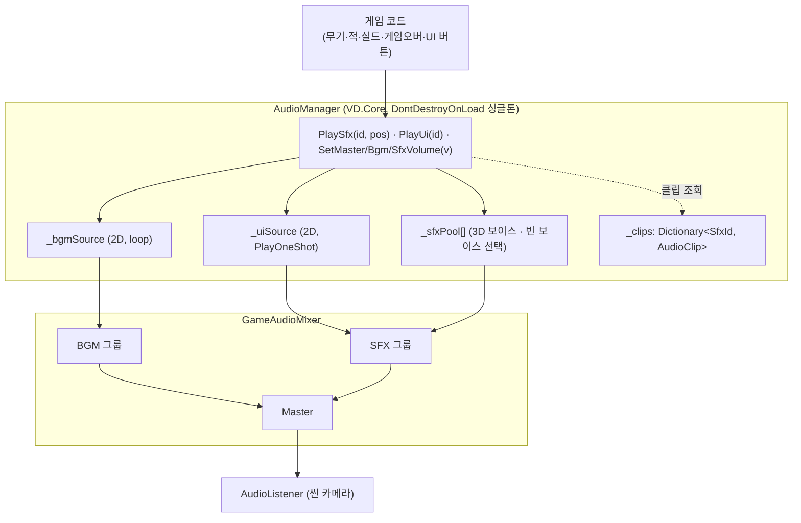
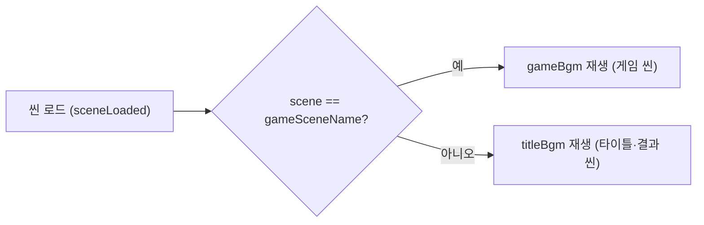
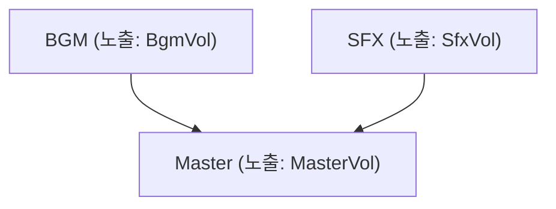

# 07 · 오디오 시스템 (BGM / SFX / 믹서)

> 런타임 사운드 재생 구조. **아키텍처·데이터·API** 중심. 상위 인덱스 = [context.md](../../context.md) §2 · 기획 사운드 항목은 onepage TODO 참조.
> 관련 코드: `Assets/Scripts/Core/AudioManager.cs`·`Assets/Scripts/Core/DamageSource.cs`·`Assets/Scripts/UI/UiButtonSfx.cs` / 믹서 `Assets/Audio/GameAudioMixer.mixer` / 오디오 에셋 `Assets/Imports/SFXs/`.

## 개요

- **단일 진입점** `VD.Core.AudioManager` (싱글톤, `DontDestroyOnLoad`) 하나가 BGM·SFX를 모두 재생한다. 게임 코드는 이 싱글톤의 메서드만 호출한다.
- **BGM** = 2D 루프, **씬에 따라 자동 전환**(게임 씬=`gameBgm`, 그 외=`titleBgm`).
- **SFX** = `SfxId` enum으로 종류를 지정. 월드 이벤트는 **3D**(`PlaySfx(id, pos)`), UI는 **2D**(`PlayUi(id)`).
- **볼륨**은 `AudioMixer`(`GameAudioMixer`)의 노출 파라미터(dB)로 그룹 단위 제어 — 볼륨 설정창(M5-10)이 이 API를 쓴다.
- 게임 코드는 전부 `AudioManager.Instance?.…` 널조건 호출 → **AudioManager가 없는 씬에서도 안전**(무음, 예외 없음).

## 아키텍처

- `Awake`에서 오디오 소스를 **코드로 생성**한다: `_bgmSource`(루프·2D) 1개, `_uiSource`(2D) 1개, `_sfxPool` `sfxVoices`개(3D). 각각 `outputAudioMixerGroup`을 믹서 그룹에 연결.
- 믹서 그룹은 이름으로 조회(`FindGroup` → `AudioMixer.FindMatchingGroups`) — 인스펙터엔 `AudioMixer` 하나와 그룹 이름 문자열(`bgmGroupName`/`sfxGroupName`)만 노출.
- **씬 카메라에 `AudioListener` 필수**(믹서 출력이 들리는 조건). Title/Result 씬 카메라에 별도 부착.

## 씬 배치 & BGM 자동 전환

- `AudioManager`는 **프리팹**(`Assets/Prefabs/AudioManager.prefab`)이며 Title/Game/Result **세 씬 모두에 인스턴스** 배치. `DontDestroyOnLoad` + `Awake`의 중복 가드(`Instance != null` → 자기 파괴)로 **씬을 어디서 시작하든 정확히 하나만** 산다(에디터 단독 씬 플레이 대비).
- BGM은 씬 로드마다 결정된다: `SceneManager.sceneLoaded` 구독 + `Start`에서 현재 씬 기준 1회.

- 같은 곡이 이미 재생 중이면 재시작하지 않고 이어간다(`ApplyBgmForScene`). 클립 미배선이면 정지.

## AudioMixer 구조 (`GameAudioMixer`)

- 그룹 = `Master` → 자식 `BGM`·`SFX`. 각 그룹의 볼륨을 노출 파라미터 **`MasterVol`/`BgmVol`/`SfxVol`(dB)** 로 이름 지정.
- 볼륨 API는 **선형 0~1 → dB** 변환 후 `AudioMixer.SetFloat`:
  `dB = (v ≤ 0.0001) ? -80 : 20·log10(v)`.

## 재생 API (`AudioManager`)

| 멤버 | 용도 | 재생 방식 |
|---|---|---|
| `PlaySfx(SfxId id, Vector3 position)` | 월드 이벤트 효과음(발사·명중·폭발·피격) | 3D, 빈 보이스 선택 |
| `PlayUi(SfxId id)` | UI 효과음(버튼) | 2D, `_uiSource.PlayOneShot` |
| `SetMasterVolume(float 0~1)` | 마스터 볼륨 | 믹서 `MasterVol` |
| `SetBgmVolume(float 0~1)` | BGM 볼륨 | 믹서 `BgmVol` |
| `SetSfxVolume(float 0~1)` | SFX 볼륨 | 믹서 `SfxVol` |
| `Instance` | 싱글톤 접근 | 정적 프로퍼티 |

> BGM 재생은 공개 메서드가 아니라 **씬 전환에 종속**(위 자동 전환). 명시 재생이 필요해지면 별도 메서드 추가.

### 3D 재생 정책 (보이스 선택)

- `_sfxPool`은 3D `AudioSource` 배열(`sfxVoices`개, 프리팹 기본 24). 각 소스: `spatialBlend = 1`, `dopplerLevel = 0`, `rolloffMode = Linear`, 거리 `sfxMinDistance`~`sfxMaxDistance`.
- `PlaySfx`는 **재생 중이 아닌 빈 보이스만** 고른다(보이스별 종료 예정 시각 `_busyUntil[i] ≤ Time.unscaledTime`). 빈 보이스가 없으면 **가장 먼저 끝나는 보이스를 스틸**.
- 이유: 아직 울리는 소리의 보이스를 재사용해 `transform.position`을 옮기면, 그 소리가 먼 위치로 순간이동해 거리감쇠로 끊기는 문제가 생김 → 빈 보이스만 써서 방지. `dopplerLevel = 0`도 같은 맥락(위치 점프 시 도플러 아티팩트 방지).
- `Time.unscaledTime` 기준 → `timeScale = 0`(게임오버 프리즈) 중에도 정상.

## SFX 카탈로그 (`SfxId` ↔ 클립 ↔ 트리거)

| `SfxId` | 클립 파일 | 트리거 | 재생 |
|---|---|---|---|
| `BasicGun` | `sfx_basicGun.mp3` | 기관총 발사 | 3D(발사점) |
| `Missile` | `sfx_missile.mp3` | 유도 미사일 발사 | 3D(발사점) |
| `Railgun` | `sfx_railgun.mp3` | 레일건 발사 | 3D(발사점) |
| `MissileHit` | `sfx_missileHit.mp3` | 유도 미사일 명중 | 3D(명중점) |
| `RailgunHit` | `sfx_railgunHit.wav` | 레일건 명중(관통마다) | 3D(명중점) |
| `ChargeAttack` | `sfx_chargeAttack.mp3` | 돌진 적 **접촉** 피격 | 3D(플레이어) |
| `HitPlayer` | `sfx_hitPlayer.mp3` | **적탄·자폭** 피격 | 3D(플레이어) |
| `SelfExplosion` | `sfx_selfExplosionAttack.mp3` | 자폭 적 폭발 | 3D(적) |
| `EnemyDead` | `sfx_enemyDead.mp3` | 적 실사망 | 3D(적) |
| `PlayerDead` | `sfx_deadExplosion.mp3` | 플레이어 사망 폭발 | 3D(플레이어) |
| `ShieldOn` | `sfx_shieldOn.mp3` | 실드 발동 | 3D(플레이어) |
| `ButtonClick` | `sfx_clickButton.mp3` | UI 버튼 클릭 | 2D |
| `ButtonHover` | `sfx_mouseHover.mp3` | UI 버튼 호버 | 2D |

**BGM**: `titleBgm` = `bgm_01_Void_Departure.mp3`(타이틀·결과), `gameBgm` = `bgm_02_Glass_Drift.mp3`(게임).

> `SfxId`↔클립 매핑은 `AudioManager` 인스펙터의 `AudioClip` 필드에 배선되어 `Awake`에서 `_clips` 딕셔너리로 구성된다. 미배선(null) 클립은 조용히 스킵.

## 트리거 연결 지점 (호출부)

| 호출부 | 호출 | 비고 |
|---|---|---|
| `StraightGun.Tick` | `PlaySfx(BasicGun, ctx.FirePoint.position)` | 발사 시 |
| `HomingMissile.Tick` | `PlaySfx(Missile, ctx.FirePoint.position)` | 발사 시 |
| `Railgun.Tick` | `PlaySfx(Railgun, ctx.FirePoint.position)` | 발사 시 |
| `HomingProjectile.OnTriggerEnter` | `PlaySfx(MissileHit, hitPos)` | 명중 지점 |
| `RailProjectile.OnTriggerEnter` | `PlaySfx(RailgunHit, hitPos)` | 관통 히트마다 |
| `PlayerHealth.ApplyDamage` | `PlaySfx(ChargeAttack \| HitPlayer, transform.position)` | 소스별 분기(아래) |
| `SuicideAttack.Explode` | `PlaySfx(SelfExplosion, self.transform.position)` | 자폭 폭발 |
| `Enemy.Die` | `PlaySfx(EnemyDead, transform.position)` | 실사망(+`deathVfx` 스폰) |
| `GameOverFlow.SpawnExplosion` | `PlaySfx(PlayerDead, pos)` | 플레이어 사망 |
| `PlayerShield.TryActivate` | `PlaySfx(ShieldOn, transform.position)` | 실드 발동 |
| `UiButtonSfx.OnPointerDown` / `OnPointerEnter` | `PlayUi(ButtonClick)` / `PlayUi(ButtonHover)` | UI 버튼 |

### 피격음 소스 분기 (`DamageSource`)

`PlayerHealth.ApplyDamage(float amount, DamageSource source)`가 공용 데미지 초크포인트다. **실드가 흡수하면(HP 무피해) 피격음 없음** — 실제 피해가 날 때만 소스로 클립을 고른다.

| `DamageSource` | 호출부 | 피격음 |
|---|---|---|
| `Contact` (기본값) | `PlayerHealth.OnTriggerEnter`(적 접촉/돌진) | `ChargeAttack` |
| `Bullet` | `EnemyBullet.OnTriggerEnter` | `HitPlayer` |
| `Suicide` | `SuicideAttack.Explode`(범위 데미지) | `HitPlayer` |

### 적 사망 VFX (`Enemy`)

`Enemy.Die`는 사망음과 함께 `deathVfx` 프리팹을 `transform.position`에 스폰(`deathVfxScale` 배수). VFX는 매번 새 인스턴스라 타 사용처와 무간섭. (현재 `CFXR3 Fire Explosion B` 재활용, 배수 1.2.)

### UI 버튼 사운드 (`UiButtonSfx`)

`VD.UI.UiButtonSfx` — 버튼 GameObject에 부착만 하면 `IPointerEnterHandler`/`IPointerDownHandler`로 호버·클릭음을 낸다(버튼별 이벤트 배선 불필요). 배치: 타이틀 버튼, 결과 화면 버튼, 레벨업 3choice 카드. (실드 버튼은 자체 발동음 `ShieldOn`이 있어 제외.)

## 오디오 에셋 임포트 설정

| 종류 | `loadType` | 압축 | 근거 |
|---|---|---|---|
| BGM | `CompressedInMemory` | Vorbis | 메모리 효율 + 안정 재생(스트리밍은 에디터 재생 이슈로 배제) |
| SFX | `DecompressOnLoad` | Vorbis | 짧은 클립, 재생 지연 최소화 |

- **무기 발사음 트리밍**: 연사로 다량의 보이스를 점유하지 않도록 죽은 꼬리를 제거(basicGun·missile·railgun). 각 컷 지점에 짧은 페이드아웃.
- **원본 백업**: `Assets/Imports/SFX_original/`(`Imports`는 git 미추적). 볼륨/트림은 항상 이 원본에서 재적용해 재인코딩 누적을 피한다.

## 알려진 이슈

- **[I-7](issues.md#i-7--sfx-끊김-적-파괴피격음-재생-시-기관총음-탁-끊김)** (보류): 연사 중 적 파괴/피격음이 겹칠 때 기관총음이 "탁" 끊기는 현상. 도플러 0·Real Voices 상향·빈 보이스 선택·클립 트리밍으로 완화했으나 잔존 → 원인 재조사 필요. 다음 조사 후보 = 미풀링 VFX 인스턴스화로 인한 오디오 버퍼 언더런.
